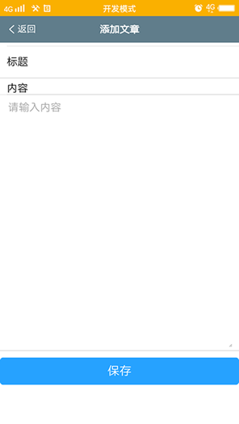
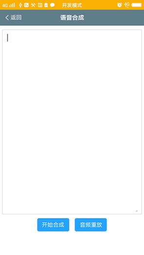
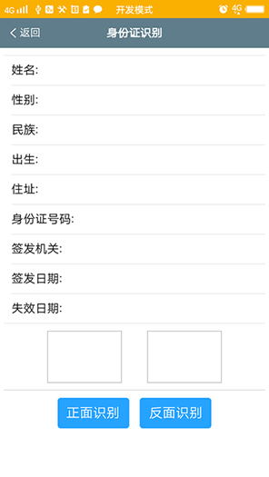

# heasy  
heasy是一个基于Android平台的APP混合开发框架，页面层集成jquery、VUE、mint-ui、muse-ui等前端框架，具有容易使用、扩展性好、灵活性强、易维护等特性。目前框架提供了百度的图片文字识别、身份证识别、驾驶证识别、语音识别、语音合成、人脸识别、中英文翻译，图片裁剪，二维码生成和扫描等功能。 

## 架构图   
 

框架的主要扩展点：  
    1、	Action类  
    2、	Service类  
    3、	前端UI框架  
    4、	JSBridge的内置JS方法  

## 开发工具  
Android Studio  

## 使用指南  
### 使用前准备  
    框架中整合了百度开发平台的文字识别、语音合成、语音识别、人脸识别和中英文翻译等功能，在编译运行工程代码前，  
    请先到百度开发平台申请开通对应的api接口使用权限。  
    
	AI开放平台：https://ai.baidu.com/  
	翻译开发平台：http://api.fanyi.baidu.com/api/trans/product/index  

	使用文字识别功能需要将AI开放平台生成的 aip.license 文件复制到baidu-ai\src\main\assets 目录下。  
    
	语音合成、语音识别、人脸识别和中英文翻译的接口参数需要更新到baidu-ai\src\main\assets\ai-config.xml 配置文件中。  

### 使用指南  
<a href="https://github.com/chenjuwen/heasy/blob/master/doc/heasy_guide.docx" target="_blank">heasy使用指南</a>  

### 部分截图  
<table>
  <tr>
    <td></td>
    <td></td>
    <td></td>
    <td></td>
    <td></td>
  </tr>
  <tr>
    <td></td>
    <td></td>
    <td></td>
    <td></td>
    <td></td>
  </tr>
  <tr>
    <td></td>
    <td></td>
    <td></td>
    <td></td>
    <td></td>
  </tr>
  <tr>
    <td></td>
    <td></td>
    <td></td>
    <td></td>
    <td></td>
  </tr>
</table>

## 技术交流  
  
